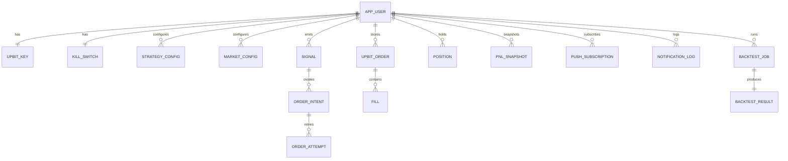

# 데이터 모델 (PostgreSQL)

Status: **Ready for Implementation (v2 MVP)**  
Owner: everbit  
Last updated: 2026-02-17 (Asia/Seoul)

이 문서는 “정합성/멱등/상태 머신”을 DB 레벨에서 보장하기 위한 **최소 스키마**를 고정한다.  
구현은 JPA를 사용하더라도, **유니크 제약과 상태 전이는 이 문서가 최종 기준(SoT)** 이다.

- ERD는 관계를 빠르게 검증하기 위한 **시각화 도구**이며, 스펙은 본 문서의 제약/상태 정의가 기준이다.
- 실행 가능한 DDL 초안은 `docs/db/schema-v2-mvp.sql` 를 따른다.
- JPA 구현 시 복합키/공유PK 매핑 표준은 `docs/architecture/jpa-mapping.md` 를 따른다.

---

## 0. ERD (Mermaid)

> 주의: `outbox_event`는 `aggregate_type + aggregate_id`의 **폴리모픽 참조**이므로 ERD에서 FK로 연결하지 않는다.

---

## 1. 공통 규칙

### 1.1 키/시간

#### 1) PK(내부 조인/성능 기준)
- 기본 PK는 `bigint GENERATED BY DEFAULT AS IDENTITY` 를 사용한다.
- 예외(의도적):
  - **1:1 테이블**은 FK를 곧 PK로 사용한다(공유 PK).
    - `upbit_key.owner_id` = PK = FK(`app_user.id`)
    - `kill_switch.owner_id` = PK = FK(`app_user.id`)
  - **자연키가 명확하고, 다른 테이블에서 참조가 거의 없는 설정성 테이블**은 복합 PK를 사용한다.
    - `strategy_config (owner_id, strategy_key)`
    - `market_config (owner_id, market)`
    - `position (owner_id, market)`
    - `backtest_result (job_id)` (job_id = PK = FK)

#### 2) 외부 노출/추적용 ID(ULID)
- 내부 `id(bigint)`는 **외부 API/URL/로그에 노출하지 않는다.**
- 외부 노출 및 상관관계 추적용으로 `public_id char(26)`(ULID)을 둔다.
  - 표준: Crockford Base32 26자(권장: 대문자)
  - 생성 주체: 애플리케이션(서버)에서 생성
  - 제약: `UNIQUE(public_id)` + `NOT NULL`

> v2 MVP 기준 public_id 적용 테이블: `app_user`, `signal`, `order_intent`, `order_attempt`, `backtest_job`  
> (필요 시 P1+에서 확대)

#### 3) UUID 사용(외부 시스템/이벤트 식별)
- Upbit 주문/체결 식별자는 **UUID 형태**이므로 PostgreSQL `uuid` 타입을 사용한다.
  - `upbit_order.upbit_uuid`
  - `order_attempt.upbit_uuid`
  - `fill.trade_uuid`
- Outbox 이벤트의 dedupe/추적 키는 `uuid` 타입 `event_id`를 사용한다.

#### 4) 시간
- 시간은 `timestamptz`(UTC)로 저장하고, 표시만 KST로 변환한다.

### 1.2 JSON 사용
- 전략/요청 파라미터는 `jsonb`로 저장한다(스키마 버전 필수).

### 1.3 상태/이벤트
- 상태 전이는 “이전 상태 → 다음 상태”가 명시되어야 한다(임의 업데이트 금지).
- 도메인 이벤트/커맨드 발행은 **Outbox/Queue(`outbox_event`)** 로 수행한다.

### 1.4 숫자 타입(정밀도)
- 거래 수치(가격/수량/수수료/손익 등)는 `numeric(38,18)`을 기본으로 사용한다.
  - v2 MVP의 데이터 규모에서는 성능보다 정합성이 우선이다.
  - 단, `strength` 같은 스코어링 값은 `numeric(18,8)` 등 축소 가능.

### 1.5 상태 값(허용 리스트)
DB는 문자열 컬럼을 쓰되, v2 MVP에서는 **CHECK 제약으로 오타/불법 상태를 차단**한다.

- `signal.side`: `BUY`, `SELL`
- `order_intent.intent_type`: `ENTRY`, `EXIT_STOPLOSS`, `EXIT_TP`, `EXIT_TRAIL`, `EXIT_TIME`
- `order_intent.status`: `CREATED`, `CANCELED`, `COMPLETED`
- `order_attempt.status`: `PREPARED`, `SENT`, `ACKED`, `REJECTED`, `THROTTLED`, `UNKNOWN`, `SUSPENDED`
- `position.status`: `FLAT`, `OPEN`, `SUSPENDED`
- `outbox_event.status`: `PENDING`, `PROCESSING`, `DONE`, `DEAD`
- `backtest_job.status`: `QUEUED`, `RUNNING`, `DONE`, `FAILED`

---

## 2. 핵심 테이블(트레이딩)

> 네이밍: PostgreSQL에서 `user`는 혼란을 유발할 수 있으므로 테이블명을 `app_user`로 고정한다.

### 2.1 app_user (싱글 테넌트 OWNER)
| Column | Type | Notes |
|---|---|---|
| id | bigint PK(identity) | 내부 PK |
| public_id | char(26) unique | 외부 노출 ULID |
| kakao_id | varchar unique | 최초 로그인 계정 고정 |
| email | varchar nullable | |
| created_at | timestamptz | |

제약:
- UNIQUE(kakao_id)
- UNIQUE(public_id)

---

### 2.2 upbit_key (암호문 저장 / 공유 PK)
| Column | Type | Notes |
|---|---|---|
| owner_id | bigint PK, FK(app_user.id) | 1:1 강제(공유 PK) |
| access_key_enc | bytea | AES-GCM ciphertext |
| secret_key_enc | bytea | AES-GCM ciphertext |
| key_version | int | 로테이션 용 |
| created_at | timestamptz | |
| rotated_at | timestamptz nullable | |

---

### 2.3 strategy_config (복합 PK)
| Column | Type | Notes |
|---|---|---|
| owner_id | bigint PK, FK(app_user.id) | |
| strategy_key | varchar PK | 예: EXTREME_FLIP |
| config_version | int | 증가 버전 |
| config_json | jsonb | 파라미터 본문 |
| updated_at | timestamptz | |

제약:
- PRIMARY KEY(owner_id, strategy_key)
- (선택) config_version은 history 테이블로 분리 가능(P1)

---

### 2.4 market_config (복합 PK)
| Column | Type | Notes |
|---|---|---|
| owner_id | bigint PK, FK(app_user.id) | |
| market | varchar PK | KRW-BTC |
| enabled | boolean | |
| priority | int | 동시 신호 시 tie-break 보조 |
| updated_at | timestamptz | |

제약:
- PRIMARY KEY(owner_id, market)

---

### 2.5 kill_switch (공유 PK)
| Column | Type | Notes |
|---|---|---|
| owner_id | bigint PK, FK(app_user.id) | |
| account_enabled | boolean | 계정 킬스위치 |
| enabled_strategies | jsonb | 허용 전략 목록(또는 별도 테이블) |
| updated_at | timestamptz | |

---

### 2.6 signal (멱등의 시작점)
| Column | Type | Notes |
|---|---|---|
| id | bigint PK(identity) | |
| public_id | char(26) unique | 외부 노출 ULID |
| owner_id | bigint FK(app_user.id) | |
| strategy_key | varchar | |
| market | varchar | |
| timeframe | varchar | 예: 15m |
| candle_close_time | timestamptz | 확정 캔들 종료 시각 |
| side | varchar | BUY/SELL(의사결정) |
| strength | numeric(18,8) | 우선순위 점수 |
| reason_code | varchar | |
| signal_json | jsonb | 계산 근거(선택) |
| created_at | timestamptz | |

제약(필수):
- UNIQUE(owner_id, strategy_key, market, timeframe, candle_close_time, side)

---

### 2.7 order_intent (주문 의도)
| Column | Type | Notes |
|---|---|---|
| id | bigint PK(identity) | |
| public_id | char(26) unique | 외부 노출 ULID |
| owner_id | bigint FK(app_user.id) | |
| signal_id | bigint FK(signal.id) | |
| intent_type | varchar | ENTRY/EXIT_STOPLOSS/EXIT_TP/EXIT_TRAIL/EXIT_TIME |
| status | varchar | CREATED/CANCELED/COMPLETED |
| market | varchar | |
| side | varchar | BUY/SELL(내부 표준) |
| requested_krw | numeric(38,18) nullable | 매수(price) 주문 총액 |
| requested_volume | numeric(38,18) nullable | 매도(market) 주문 수량 |
| reason_code | varchar | |
| created_at | timestamptz | |

제약(필수):
- UNIQUE(signal_id, intent_type)

---

### 2.8 order_attempt (Upbit 호출 1회)
| Column | Type | Notes |
|---|---|---|
| id | bigint PK(identity) | |
| public_id | char(26) unique | 외부 노출 ULID |
| owner_id | bigint FK(app_user.id) | |
| order_intent_id | bigint FK(order_intent.id) | |
| attempt_no | int | 1..N |
| identifier | varchar | Attempt별 신규(재사용 금지) |
| upbit_uuid | uuid nullable | ACK 시 확보 |
| status | varchar | PREPARED/SENT/ACKED/REJECTED/THROTTLED/UNKNOWN/SUSPENDED |
| error_code | varchar nullable | |
| error_message | text nullable | |
| next_retry_at | timestamptz nullable | 429 전용 |
| created_at | timestamptz | |
| updated_at | timestamptz | |

제약(필수):
- UNIQUE(order_intent_id, attempt_no)
- UNIQUE(identifier)

---

### 2.9 upbit_order (Upbit 주문 실체 / 외부키는 uuid)
| Column | Type | Notes |
|---|---|---|
| id | bigint PK(identity) | 내부 PK |
| owner_id | bigint FK(app_user.id) | |
| upbit_uuid | uuid unique | Upbit 주문 uuid |
| identifier | varchar nullable | 주문 생성 시 사용(상관관계) |
| market | varchar | |
| side | varchar | bid/ask (Upbit raw) |
| ord_type | varchar | limit/market/price/best (Upbit raw) |
| state | varchar | wait/done/cancel... (Upbit raw) |
| price | numeric(38,18) nullable | |
| volume | numeric(38,18) nullable | |
| executed_volume | numeric(38,18) | |
| created_at | timestamptz | |
| updated_at | timestamptz | |

제약:
- UNIQUE(upbit_uuid)

---

### 2.10 fill (체결 / trade_uuid로 멱등)
| Column | Type | Notes |
|---|---|---|
| id | bigint PK(identity) | |
| owner_id | bigint FK(app_user.id) | |
| upbit_uuid | uuid FK(upbit_order.upbit_uuid) | 주문 uuid |
| trade_uuid | uuid unique | 체결의 유일 식별자(멱등키) |
| trade_time | timestamptz | |
| price | numeric(38,18) | |
| volume | numeric(38,18) | |
| fee | numeric(38,18) nullable | |
| created_at | timestamptz | |

인덱스:
- INDEX(upbit_uuid, trade_time)

제약:
- UNIQUE(trade_uuid)

---

### 2.11 position (마켓별 포지션 / 복합 PK)
| Column | Type | Notes |
|---|---|---|
| owner_id | bigint PK, FK(app_user.id) | |
| market | varchar PK | |
| quantity | numeric(38,18) | 보유 수량 |
| avg_price | numeric(38,18) | 평균단가 |
| status | varchar | FLAT/OPEN/SUSPENDED |
| updated_at | timestamptz | |

---

### 2.12 pnl_snapshot (손익 스냅샷)
| Column | Type | Notes |
|---|---|---|
| id | bigint PK(identity) | |
| owner_id | bigint FK(app_user.id) | |
| market | varchar | |
| realized_pnl | numeric(38,18) | |
| unrealized_pnl | numeric(38,18) | |
| equity | numeric(38,18) | |
| captured_at | timestamptz | |

인덱스:
- INDEX(owner_id, captured_at)

---

## 3. Outbox/Queue(필수)

v2 MVP에서는 Kafka 없이 PostgreSQL을 이벤트 버스/큐로 사용한다.  
도메인 변경(SoT)과 “비동기 처리 트리거”를 동일 트랜잭션으로 묶기 위해 `outbox_event` 테이블을 사용한다.

- 발행: 트랜잭션 내 `outbox_event` INSERT
- 소비: 워커가 `FOR UPDATE SKIP LOCKED`로 claim 후 처리
- 재시도/백오프: `attempt_count`, `next_retry_at` 등으로 DB에서 관리

상세 스펙: `docs/architecture/event-bus.md`

### 3.1 outbox_event
| Column | Type | Notes |
|---|---|---|
| id | bigint PK(identity) | 처리 순서/인덱싱 |
| event_id | uuid unique | dedupe/추적 키 |
| stream | varchar | 예: everbit.trade.command |
| event_type | varchar | CreateOrderAttempt/OrderAccepted/... |
| aggregate_type | varchar | 예: ORDER_INTENT, ORDER_ATTEMPT |
| aggregate_id | bigint nullable | v2 MVP 기준 bigint aggregate만 사용 |
| payload_json | jsonb | envelope 또는 payload |
| status | varchar | PENDING/PROCESSING/DONE/DEAD |
| attempt_count | int | default 0 |
| max_attempts | int | default 10(권장) |
| next_retry_at | timestamptz | default now() |
| last_attempt_at | timestamptz nullable | |
| locked_by | varchar nullable | 워커 식별자 |
| locked_until | timestamptz nullable | 스테일 락 복구용 TTL |
| last_error_code | varchar nullable | |
| last_error_message | text nullable | |
| created_at | timestamptz | |
| updated_at | timestamptz | |
| processed_at | timestamptz nullable | DONE 시각 |

인덱스(권장):
- INDEX(stream, status, next_retry_at)
- INDEX(status, next_retry_at)
- INDEX(created_at)

제약:
- UNIQUE(event_id)

주의:
- 외부 호출(Upbit/WebPush)은 **DB 락을 잡은 채로 수행하지 않는다**.
- claim(점유) 트랜잭션은 짧게 종료하고, 처리 결과만 업데이트한다.
- (P1+) aggregate_id가 bigint가 아닌 이벤트가 필요해지면 `payload_json`에 `aggregate_key`를 추가한다.

---

## 4. 푸시 알림

### 4.1 push_subscription
| Column | Type | Notes |
|---|---|---|
| id | bigint PK(identity) | |
| owner_id | bigint FK(app_user.id) | |
| endpoint | text | subscription endpoint |
| p256dh | text | key |
| auth | text | key |
| user_agent | text nullable | |
| enabled | boolean | |
| created_at | timestamptz | |
| updated_at | timestamptz | |

제약:
- UNIQUE(owner_id, endpoint)

### 4.2 notification_log (선택)
| Column | Type | Notes |
|---|---|---|
| id | bigint PK(identity) | |
| owner_id | bigint FK(app_user.id) | |
| event_id | uuid | dedupe 용 |
| type | varchar | ORDER_ACCEPTED 등 |
| payload_json | jsonb | |
| delivered_at | timestamptz nullable | |
| created_at | timestamptz | |

제약(권장):
- UNIQUE(owner_id, event_id)

---

## 5. 백테스트

### 5.1 backtest_job
| Column | Type | Notes |
|---|---|---|
| id | bigint PK(identity) | |
| public_id | char(26) unique | 외부 노출 ULID |
| owner_id | bigint FK(app_user.id) | |
| status | varchar | QUEUED/RUNNING/DONE/FAILED |
| request_json | jsonb | markets/timeframes/period/params |
| created_at | timestamptz | |
| updated_at | timestamptz | |

### 5.2 backtest_result (공유 PK)
| Column | Type | Notes |
|---|---|---|
| job_id | bigint PK, FK(backtest_job.id) | |
| metrics_json | jsonb | CAGR/MDD/승률/수익팩터 |
| equity_curve_json | jsonb nullable | 선택 |
| created_at | timestamptz | |

---

## 6. 마이그레이션/스키마 변경 규칙

- 스키마 변경은 반드시 ADR 또는 변경 로그를 남긴다.
- 유니크/인덱스는 “성능 최적화”가 아니라 “정합성 스펙”이므로 임의 변경 금지.
- 실행 가능한 DDL 초안: `docs/db/schema-v2-mvp.sql` (v2 MVP)
