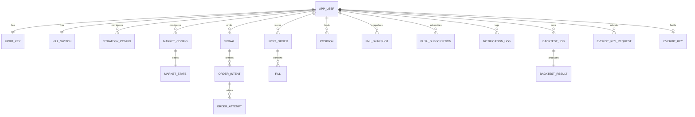

# 데이터 모델 (PostgreSQL)

Status: **Ready for Implementation (v2 MVP)**  
Owner: everbit  
Last updated: 2026-03-11 (Asia/Seoul)

이 문서는 “정합성/멱등/상태 머신”을 DB 레벨에서 보장하기 위한 **최소 스키마**를 고정한다.  
구현은 JPA를 사용하더라도, **유니크 제약과 상태 전이, 물리 FK/논리 관계의 기준은 이 문서가 최종 SoT** 이다.

- ERD는 관계를 빠르게 검증하기 위한 **시각화 도구**이며, 스펙은 본 문서의 제약/상태 정의가 기준이다.
- 실행 가능한 DDL 초안은 `docs/db/schema-v2-mvp.sql` 를 따른다.
- JPA 구현 시 복합키/공유PK/복합 FK 매핑 표준은 `docs/architecture/jpa-mapping.md` 를 따른다.
- **테이블/컬럼 네이밍**: Spring Boot `SpringPhysicalNamingStrategy`가 camelCase → snake_case 자동 매핑하므로, JPA 엔티티에서 `@Table`/`@Column` name을 명시할 필요가 없다.

---

## 0. ERD (Mermaid)

> 주의 1: `outbox_event`는 `aggregate_type + aggregate_id`의 **폴리모픽 참조**이므로 ERD에서 FK로 연결하지 않는다.  
> 주의 2: `signal.strategy_key`, `signal.market`는 **히스토리 스냅샷 값**이며, 변경 가능한 설정 테이블과는 의도적으로 물리 FK를 두지 않는다.

```mermaid
erDiagram
  APP_USER ||--|| UPBIT_KEY : has
  APP_USER ||--|| KILL_SWITCH : has
  APP_USER ||--o{ STRATEGY_CONFIG : configures
  APP_USER ||--o{ MARKET_CONFIG : configures
  MARKET_CONFIG ||--|| MARKET_STATE : tracks

  APP_USER ||--o{ SIGNAL : emits
  SIGNAL ||--o{ ORDER_INTENT : creates
  ORDER_INTENT ||--o{ ORDER_ATTEMPT : retries

  APP_USER ||--o{ UPBIT_ORDER : stores
  UPBIT_ORDER ||--o{ FILL : contains

  APP_USER ||--o{ POSITION : holds
  APP_USER ||--o{ PNL_SNAPSHOT : snapshots

  APP_USER ||--o{ PUSH_SUBSCRIPTION : subscribes
  APP_USER ||--o{ NOTIFICATION_LOG : logs

  APP_USER ||--o{ BACKTEST_JOB : runs
  BACKTEST_JOB ||--|| BACKTEST_RESULT : produces

  APP_USER ||--o{ EVERBIT_KEY_REQUEST : submits
  APP_USER ||--|o EVERBIT_KEY : holds
```

---

## 1. 공통 규칙

### 1.1 키/시간

#### 1) PK(내부 조인/성능 기준)
- 기본 PK는 `bigint GENERATED BY DEFAULT AS IDENTITY` 를 사용한다.
- 예외(의도적):
  - **1:1 테이블**은 FK를 곧 PK로 사용한다(공유 PK).
    - `upbit_key.owner_id` = PK = FK(`app_user.id`)
    - `kill_switch.owner_id` = PK = FK(`app_user.id`)
    - `backtest_result.job_id` = PK = FK(`backtest_job.id`)
  - **자연키가 명확하고 설정/상태 성격이 강한 테이블**은 복합 PK를 사용한다.
    - `strategy_config (owner_id, strategy_key)`
    - `market_config (owner_id, market)`
    - `market_state (owner_id, market)`
    - `position (owner_id, market)`
    - `candle_cache (market, timeframe, candle_time)`

#### 2) 외부 노출/추적용 ID(UUID v7)
- 내부 `id(bigint)`는 **외부 API/URL/로그에 노출하지 않는다.**
- 외부 노출 및 상관관계 추적용으로 `public_id uuid`(UUID v7)을 둔다.
  - 표준: RFC 4122 UUID v7 (시간순 정렬 가능)
  - 생성 주체: 애플리케이션(서버)
  - 제약: `UNIQUE(public_id)` + `NOT NULL`

> v2 MVP 기준 `public_id` 적용 테이블: `app_user`, `signal`, `order_intent`, `order_attempt`, `backtest_job`  
> (필요 시 P1+에서 확대)

#### 3) UUID 사용(외부 시스템/이벤트 식별)
- Upbit 주문/체결 식별자는 **UUID 형태**이므로 PostgreSQL `uuid` 타입을 사용한다.
  - `upbit_order.upbit_uuid`
  - `order_attempt.upbit_uuid`
  - `fill.trade_uuid`
- Outbox 이벤트의 dedupe/추적 키는 `uuid` 타입 `event_id`를 사용한다.

#### 4) 공통 감사 컬럼(BaseEntity)
- JPA 엔티티는 원칙적으로 **`BaseEntity(created_at, updated_at)`** 를 상속한다.
- 따라서 **엔티티 테이블에는 `created_at`, `updated_at` 두 컬럼을 모두 둔다.**
  - append-only 성격의 row라도 `updated_at`은 유지한다. 일반적으로 insert 직후 `created_at == updated_at` 이다.
- 비즈니스 시각은 별도 컬럼으로 둔다.
  - 예: `candle_close_time`, `trade_time`, `captured_at`, `rotated_at`, `suspended_at`, `delivered_at`
- 시간은 `timestamptz`(UTC)로 저장하고, 표시만 KST로 변환한다.
- Java 타입은 `Instant`를 권장한다. `LocalDateTime`을 쓸 경우에는 **애플리케이션/JDBC/Hibernate timezone을 UTC로 고정**해야 한다.

### 1.2 JSON 사용
- 전략/요청 파라미터는 `jsonb`로 저장한다(스키마 버전 필수).

### 1.3 상태/이벤트
- 상태 전이는 “이전 상태 → 다음 상태”가 명시되어야 한다(임의 업데이트 금지).
- 도메인 이벤트/커맨드 발행은 **Outbox/Queue(`outbox_event`)** 로 수행한다.

### 1.4 숫자 타입(정밀도)
- 거래 수치(가격/수량/수수료/손익 등)는 `numeric(38,18)`을 기본으로 사용한다.
  - v2 MVP의 데이터 규모에서는 성능보다 정합성이 우선이다.
  - 단, `strength` 같은 스코어링 값은 `numeric(18,8)` 등 축소 가능.
- 명확히 음수가 될 수 없는 값은 CHECK 제약으로 방어한다.
  - 예: 주문 수량/금액, 체결 수량, 평균단가, 캔들 OHLC

### 1.5 상태 값(허용 리스트)
DB는 문자열 컬럼을 쓰되, v2 MVP에서는 **CHECK 제약으로 오타/불법 상태를 차단**한다.

- `app_user.role`: `ADMIN`, `USER`
- `app_user.everbit_key_status`: `NONE`, `PENDING`, `ACTIVE`, `REVOKED`
- `everbit_key_request.status`: `PENDING`, `APPROVED`, `REJECTED`
- `everbit_key.status`: `ACTIVE`, `REVOKED`
- `signal.side`: `BUY`, `SELL`
- `order_intent.intent_type`: `ENTRY`, `EXIT_STOPLOSS`, `EXIT_TP`, `EXIT_TRAIL`, `EXIT_TIME`
- `order_intent.status`: `CREATED`, `CANCELED`, `COMPLETED`
- `order_attempt.status`: `PREPARED`, `SENT`, `ACKED`, `REJECTED`, `THROTTLED`, `UNKNOWN`, `SUSPENDED`
- `position.status`: `FLAT`, `OPEN`
- `market_state.trade_status`: `ACTIVE`, `SUSPENDED`
- `outbox_event.status`: `PENDING`, `PROCESSING`, `DONE`, `DEAD`
- `backtest_job.status`: `QUEUED`, `RUNNING`, `DONE`, `FAILED`

### 1.6 물리 관계 vs 논리 관계(중요)
- **물리 FK를 두는 관계**
  - 생명주기가 명확한 부모-자식 관계
  - owner 일치가 반드시 보장되어야 하는 관계
  - 예: `order_intent → signal`, `order_attempt → order_intent`, `fill → upbit_order`
- **논리 관계로만 유지하는 관계**
  - 과거 히스토리 row가 현재 설정 row의 존재 여부에 종속되면 안 되는 경우
  - 예: `signal.strategy_key ↔ strategy_config`, `signal.market ↔ market_config`
- `owner_id`를 중복 보유하는 테이블(`signal`, `order_intent`, `order_attempt`, `upbit_order`, `fill`)은 조회/인덱싱 편의를 위해 유지하되,
  **복합 FK/UNIQUE로 부모와 같은 owner임을 강제**한다.
- `outbox_event`는 폴리모픽이므로 물리 FK를 두지 않는다.

---

## 2. 핵심 테이블(트레이딩)

> 네이밍: PostgreSQL에서 `user`는 혼란을 유발할 수 있으므로 테이블명을 `app_user`로 고정한다.

### 2.1 app_user (멀티유저 — ADMIN / USER)

> ADR: [ADR-0010](../../adr/0010-multi-user-everbit-key.md)

| Column | Type | Notes |
|---|---|---|
| owner_id | bigint PK(identity) | 내부 PK (사용자 식별자) |
| public_id | uuid unique | 외부 노출 UUID v7 |
| kakao_id | varchar unique | 카카오 계정 ID |
| email | varchar nullable | |
| role | varchar | ADMIN / USER |
| everbit_key_status | varchar | NONE / PENDING / ACTIVE / REVOKED (ADMIN은 항상 NONE으로 간주, 검사 생략) |
| created_at | timestamptz | 생성 시각 |
| updated_at | timestamptz | 마지막 수정 시각 |

제약:
- UNIQUE(kakao_id)
- UNIQUE(public_id)
- CHECK role IN ('ADMIN', 'USER')
- CHECK everbit_key_status IN ('NONE', 'PENDING', 'ACTIVE', 'REVOKED')

비즈니스 규칙:
- 최초 가입자는 role = `ADMIN`으로 등록된다. 이후 가입자는 `USER`로 등록된다.
- `USER`의 실거래 게이트는 `everbit_key_status = ACTIVE`를 요구한다.
- `ADMIN`은 `everbit_key_status` 조건을 건너뛴다.

---

### 2.2 upbit_key (암호문 저장 / 공유 PK)
| Column | Type | Notes |
|---|---|---|
| owner_id | bigint PK, FK(app_user.owner_id) | 1:1 강제(공유 PK) |
| access_key_enc | bytea | AES-GCM ciphertext |
| secret_key_enc | bytea | AES-GCM ciphertext |
| key_version | int | 로테이션 용 |
| rotated_at | timestamptz nullable | 마지막 로테이션 시각 |
| created_at | timestamptz | 생성 시각 |
| updated_at | timestamptz | 마지막 수정 시각 |

---

### 2.3 everbit_key_request (발급 요청)

> ADR: [ADR-0010](../../adr/0010-multi-user-everbit-key.md)

| Column | Type | Notes |
|---|---|---|
| request_id | bigint PK(identity) | |
| user_id | bigint FK(app_user.owner_id) | 요청자 |
| purpose | text | 서비스 이용 목적 |
| contact_info | text | 연락처/개인 정보(최소화) |
| status | varchar | PENDING / APPROVED / REJECTED |
| admin_note | varchar nullable | 거부 사유 등 운영자 메모 |
| reviewed_by | bigint FK(app_user.owner_id) nullable | 심사한 ADMIN |
| reviewed_at | timestamptz nullable | 심사 완료 시각 |
| created_at | timestamptz | 생성 시각 |
| updated_at | timestamptz | 마지막 수정 시각 |

제약:
- CHECK status IN ('PENDING', 'APPROVED', 'REJECTED')
- 동일 `user_id`에 대해 `status IN ('PENDING', 'APPROVED')` 인 row가 이미 존재하면 신규 INSERT를 차단한다(애플리케이션 레이어 검증 + PARTIAL INDEX 활용 권장).

---

### 2.4 everbit_key (발급된 키 / 공유 PK)

> ADR: [ADR-0010](../../adr/0010-multi-user-everbit-key.md)

| Column | Type | Notes |
|---|---|---|
| user_id | bigint PK, FK(app_user.owner_id) | 1:1 강제(공유 PK) |
| key_value | varchar unique | UUID v7 기반 생성 토큰. 사용자에게 전달되는 키 값 |
| status | varchar | ACTIVE / REVOKED |
| issued_at | timestamptz | 키 발급 시각 |
| revoked_at | timestamptz nullable | 키 폐기 시각 |
| created_at | timestamptz | 생성 시각 |
| updated_at | timestamptz | 마지막 수정 시각 |

제약:
- UNIQUE(key_value)
- CHECK status IN ('ACTIVE', 'REVOKED')

보안 주의:
- `key_value`는 로그에 기록하지 않는다(로깅 금지 항목).
- API 응답에서 `key_value`는 본인 조회 시에만 노출하고, 목록/ADMIN 조회에서는 마스킹한다.

---

### 2.5 strategy_config (복합 PK)
| Column | Type | Notes |
|---|---|---|
| owner_id | bigint PK, FK(app_user.owner_id) | |
| strategy_key | varchar PK | 예: EXTREME_FLIP |
| config_version | int | 증가 버전 |
| config_json | jsonb | 파라미터 본문 |
| created_at | timestamptz | 생성 시각 |
| updated_at | timestamptz | 마지막 수정 시각 |

제약:
- PRIMARY KEY(owner_id, strategy_key)
- (선택) `config_version` history는 P1+에서 별도 테이블로 분리 가능

---

### 2.6 market_config (복합 PK)
| Column | Type | Notes |
|---|---|---|
| owner_id | bigint PK, FK(app_user.owner_id) | |
| market | varchar PK | KRW-BTC |
| enabled | boolean | 시장 enable/disable |
| priority | int | 동시 신호 시 tie-break 보조 |
| created_at | timestamptz | 생성 시각 |
| updated_at | timestamptz | 마지막 수정 시각 |

제약:
- PRIMARY KEY(owner_id, market)

---

### 2.7 market_state (마켓 실행 상태 SoT / 복합 PK)
| Column | Type | Notes |
|---|---|---|
| owner_id | bigint PK | `market_config.owner_id`와 동일 |
| market | varchar PK | `market_config.market`와 동일 |
| trade_status | varchar | ACTIVE / SUSPENDED |
| suspend_reason_code | varchar nullable | UNKNOWN 확정 실패 등 |
| suspended_at | timestamptz nullable | 마지막 SUSPENDED 진입 시각 |
| last_signal_at | timestamptz nullable | 최근 Signal.candle_close_time |
| cooldown_until | timestamptz nullable | 전략 쿨다운 만료 시각 |
| created_at | timestamptz | 생성 시각 |
| updated_at | timestamptz | 마지막 수정 시각 |

제약:
- PRIMARY KEY(owner_id, market)
- FOREIGN KEY(owner_id, market) → `market_config(owner_id, market)`

주의:
- **시장 SUSPENDED는 `position.status`가 아니라 `market_state.trade_status`에 저장한다.**
- `position`은 보유 상태, `market_state`는 실행 가능 상태를 나타낸다.

---

### 2.8 kill_switch (공유 PK)
| Column | Type | Notes |
|---|---|---|
| owner_id | bigint PK, FK(app_user.owner_id) | |
| account_enabled | boolean | 계정 킬스위치 |
| enabled_strategies | jsonb | 허용 전략 목록(또는 별도 테이블) |
| created_at | timestamptz | 생성 시각 |
| updated_at | timestamptz | 마지막 수정 시각 |

---

### 2.9 signal (멱등의 시작점)
| Column | Type | Notes |
|---|---|---|
| signal_id | bigint PK(identity) | |
| public_id | uuid unique | 외부 노출 UUID v7 |
| owner_id | bigint FK(app_user.owner_id) | |
| strategy_key | varchar | 생성 시점 전략 스냅샷 |
| market | varchar | 생성 시점 마켓 스냅샷 |
| timeframe | varchar | 예: 15m |
| candle_close_time | timestamptz | 확정 캔들 종료 시각 |
| side | varchar | BUY/SELL(의사결정) |
| strength | numeric(18,8) | 우선순위 점수 |
| reason_code | varchar | |
| signal_json | jsonb | 계산 근거(선택) |
| created_at | timestamptz | 생성 시각 |
| updated_at | timestamptz | 마지막 수정 시각 |

제약(필수):
- UNIQUE(owner_id, strategy_key, market, timeframe, candle_close_time, side)

주의:
- `strategy_key`, `market`는 히스토리 스냅샷 값이다. 현재 설정 row와는 의도적으로 물리 FK를 두지 않는다.

---

### 2.10 order_intent (주문 의도)
| Column | Type | Notes |
|---|---|---|
| order_intent_id | bigint PK(identity) | |
| public_id | uuid unique | 외부 노출 UUID v7 |
| owner_id | bigint FK(app_user.owner_id) | Signal.owner_id와 동일해야 함 |
| signal_id | bigint FK(signal.signal_id) | |
| intent_type | varchar | ENTRY/EXIT_STOPLOSS/EXIT_TP/EXIT_TRAIL/EXIT_TIME |
| status | varchar | CREATED/CANCELED/COMPLETED |
| market | varchar | Signal 시점 스냅샷 |
| side | varchar | BUY/SELL(내부 표준) |
| requested_krw | numeric(38,18) nullable | 매수(price) 주문 총액 |
| requested_volume | numeric(38,18) nullable | 매도(market) 주문 수량 |
| reason_code | varchar | |
| created_at | timestamptz | 생성 시각 |
| updated_at | timestamptz | 마지막 수정 시각 |

제약(필수):
- UNIQUE(signal_id, intent_type)
- `side=BUY`이면 `requested_krw`만, `side=SELL`이면 `requested_volume`만 허용
- `(signal_id, owner_id)`는 부모 Signal과 owner 일치가 보장되어야 함

상태 의미:
- `CREATED`: 의도 생성 완료, 아직 최종 수렴 전
- `CANCELED`: 실행 전 차단/무효화/운영 취소로 종료
- `COMPLETED`: 의도한 주문/포지션 결과가 최종 반영됨

---

### 2.11 order_attempt (Upbit 호출 1회)
| Column | Type | Notes |
|---|---|---|
| order_attempt_id | bigint PK(identity) | |
| public_id | uuid unique | 외부 노출 UUID v7 |
| owner_id | bigint FK(app_user.owner_id) | OrderIntent.owner_id와 동일해야 함 |
| order_intent_id | bigint FK(order_intent.order_intent_id) | |
| attempt_no | int | 1..N |
| identifier | varchar | Attempt별 신규(재사용 금지) |
| request_json | jsonb | Upbit CreateOrder payload canonical snapshot |
| upbit_uuid | uuid nullable | ACK 시 확보 |
| status | varchar | PREPARED/SENT/ACKED/REJECTED/THROTTLED/UNKNOWN/SUSPENDED |
| error_code | varchar nullable | |
| error_message | text nullable | |
| next_retry_at | timestamptz nullable | 429 전용 |
| created_at | timestamptz | 생성 시각 |
| updated_at | timestamptz | 마지막 수정 시각 |

제약(필수):
- UNIQUE(order_intent_id, attempt_no)
- UNIQUE(identifier)
- UNIQUE(upbit_uuid) WHERE upbit_uuid IS NOT NULL
- `status=ACKED`이면 `upbit_uuid`가 반드시 존재해야 함
- `status=THROTTLED`이면 `next_retry_at`이 반드시 존재해야 함
- `(order_intent_id, owner_id)`는 부모 OrderIntent와 owner 일치가 보장되어야 함

역할:
- `order_intent`는 semantic intent
- `order_attempt.request_json`은 executable snapshot
- outbox `CreateOrderAttempt` payload는 **orderAttemptId만** 전달

---

### 2.12 upbit_order (Upbit 주문 실체 / 외부키는 uuid)
| Column | Type | Notes |
|---|---|---|
| upbit_order_id | bigint PK(identity) | 내부 PK |
| owner_id | bigint FK(app_user.owner_id) | |
| upbit_uuid | uuid unique | Upbit 주문 uuid |
| identifier | varchar nullable | 주문 생성 시 사용(상관관계) |
| market | varchar | |
| side | varchar | bid/ask (Upbit raw) |
| ord_type | varchar | limit/market/price/best (Upbit raw) |
| state | varchar | wait/done/cancel... (Upbit raw) |
| price | numeric(38,18) nullable | |
| volume | numeric(38,18) nullable | |
| executed_volume | numeric(38,18) | |
| created_at | timestamptz | 생성 시각 |
| updated_at | timestamptz | 마지막 수정 시각 |

제약:
- UNIQUE(upbit_uuid)

주의:
- 시스템이 생성한 주문은 보통 `order_attempt.upbit_uuid` 또는 `identifier`로 상관관계를 맺지만,
  reconcile/외부 유입 주문까지 고려해 `order_attempt`에 대한 물리 FK는 두지 않는다.

---

### 2.13 fill (체결 / trade_uuid로 멱등)
| Column | Type | Notes |
|---|---|---|
| fill_id | bigint PK(identity) | |
| owner_id | bigint FK(app_user.owner_id) | UpbitOrder.owner_id와 동일해야 함 |
| upbit_uuid | uuid FK(upbit_order.upbit_uuid) | 주문 uuid |
| trade_uuid | uuid unique | 체결의 유일 식별자(멱등키) |
| trade_time | timestamptz | |
| price | numeric(38,18) | |
| volume | numeric(38,18) | |
| fee | numeric(38,18) nullable | |
| created_at | timestamptz | 생성 시각 |
| updated_at | timestamptz | 마지막 수정 시각 |

인덱스:
- INDEX(upbit_uuid, trade_time)

제약:
- UNIQUE(trade_uuid)
- `(upbit_uuid, owner_id)`는 부모 UpbitOrder와 owner 일치가 보장되어야 함

---

### 2.14 position (마켓별 포지션 / 복합 PK)
| Column | Type | Notes |
|---|---|---|
| owner_id | bigint PK, FK(app_user.owner_id) | |
| market | varchar PK | |
| quantity | numeric(38,18) | 보유 수량 |
| avg_price | numeric(38,18) | 평균단가 |
| status | varchar | FLAT/OPEN |
| created_at | timestamptz | 생성 시각 |
| updated_at | timestamptz | 마지막 수정 시각 |

주의:
- `position.status`는 **보유 상태만** 표현한다.
- 실행 중단 상태는 `market_state.trade_status`로 관리한다.

---

### 2.15 pnl_snapshot (손익 스냅샷)
| Column | Type | Notes |
|---|---|---|
| pnl_snapshot_id | bigint PK(identity) | |
| owner_id | bigint FK(app_user.owner_id) | |
| market | varchar | |
| realized_pnl | numeric(38,18) | |
| unrealized_pnl | numeric(38,18) | |
| equity | numeric(38,18) | |
| captured_at | timestamptz | 비즈니스 시각 |
| created_at | timestamptz | 생성 시각 |
| updated_at | timestamptz | 마지막 수정 시각 |

인덱스:
- INDEX(owner_id, captured_at)

---

## 3. Outbox/Queue(필수)

v2 MVP에서는 Kafka 없이 PostgreSQL을 이벤트 버스/큐로 사용한다.  
도메인 변경(SoT)과 “비동기 처리 트리거”를 동일 트랜잭션으로 묶기 위해 `outbox_event` 테이블을 사용한다.

- 발행: 트랜잭션 내 `outbox_event` INSERT
- 소비: 워커가 `FOR UPDATE SKIP LOCKED`로 claim 후 처리
- 재시도/백오프: `attempt_count`, `next_retry_at` 등으로 DB에서 관리

상세 스펙: `docs/architecture/event-bus.md`

### 3.1 outbox_event
| Column | Type | Notes |
|---|---|---|
| outbox_event_id | bigint PK(identity) | 처리 순서/인덱싱 |
| event_id | uuid unique | dedupe/추적 키 |
| stream | varchar | 예: everbit.trade.command |
| event_type | varchar | CreateOrderAttempt/OrderAccepted/... |
| aggregate_type | varchar | 예: ORDER_INTENT, ORDER_ATTEMPT |
| aggregate_id | bigint nullable | v2 MVP 기준 bigint aggregate만 사용 |
| payload_json | jsonb | envelope 또는 payload |
| status | varchar | PENDING/PROCESSING/DONE/DEAD |
| attempt_count | int | default 0 |
| max_attempts | int | default 10(권장) |
| next_retry_at | timestamptz | default now() |
| last_attempt_at | timestamptz nullable | |
| locked_by | varchar nullable | 워커 식별자 |
| locked_until | timestamptz nullable | 스테일 락 복구용 TTL |
| last_error_code | varchar nullable | |
| last_error_message | text nullable | |
| created_at | timestamptz | 생성 시각 |
| updated_at | timestamptz | 마지막 수정 시각 |
| processed_at | timestamptz nullable | DONE 시각 |

인덱스(권장):
- INDEX(stream, status, next_retry_at)
- INDEX(status, next_retry_at)
- INDEX(created_at)

제약:
- UNIQUE(event_id)

주의:
- 외부 호출(Upbit/WebPush)은 **DB 락을 잡은 채로 수행하지 않는다**.
- claim(점유) 트랜잭션은 짧게 종료하고, 처리 결과만 업데이트한다.
- (P1+) aggregate_id가 bigint가 아닌 이벤트가 필요해지면 `payload_json`에 `aggregate_key`를 추가한다.

---

## 4. 푸시 알림

### 4.1 push_subscription
| Column | Type | Notes |
|---|---|---|
| push_subscription_id | bigint PK(identity) | |
| owner_id | bigint FK(app_user.owner_id) | |
| endpoint | text | subscription endpoint |
| p256dh | text | key |
| auth | text | key |
| user_agent | text nullable | |
| enabled | boolean | |
| created_at | timestamptz | 생성 시각 |
| updated_at | timestamptz | 마지막 수정 시각 |

제약:
- UNIQUE(owner_id, endpoint)

### 4.2 notification_log (선택)
| Column | Type | Notes |
|---|---|---|
| notification_log_id | bigint PK(identity) | |
| owner_id | bigint FK(app_user.owner_id) | |
| event_id | uuid | dedupe 용 |
| type | varchar | ORDER_ACCEPTED 등 |
| payload_json | jsonb | |
| delivered_at | timestamptz nullable | 실제 발송 완료 시각 |
| created_at | timestamptz | 생성 시각 |
| updated_at | timestamptz | 마지막 수정 시각 |

제약(권장):
- UNIQUE(owner_id, event_id)

---

## 5. 백테스트

### 5.0 candle_cache (백테스트 캔들 캐시 — canonical source)
백테스트는 DB 캔들만 사용한다. 누락 구간은 실행 전 fetch + upsert 후 진행(Phase 0 결정: 1안).

| Column | Type | Notes |
|---|---|---|
| market | varchar PK | KRW-BTC 등 |
| timeframe | varchar PK | 15, 60 등 |
| candle_time | timestamptz PK | 캔들 종료 시각(확정 close) |
| open | numeric(38,18) | |
| high | numeric(38,18) | |
| low | numeric(38,18) | |
| close | numeric(38,18) | |
| volume | numeric(38,18) | |
| created_at | timestamptz | 생성 시각 |
| updated_at | timestamptz | 마지막 수정 시각 |

제약(필수):
- PRIMARY KEY(market, timeframe, candle_time)

### 5.1 backtest_job
| Column | Type | Notes |
|---|---|---|
| backtest_job_id | bigint PK(identity) | |
| public_id | uuid unique | 외부 노출 UUID v7 |
| owner_id | bigint FK(app_user.owner_id) | |
| status | varchar | QUEUED/RUNNING/DONE/FAILED |
| request_json | jsonb | markets/timeframes/period/params |
| created_at | timestamptz | 생성 시각 |
| updated_at | timestamptz | 마지막 수정 시각 |

### 5.2 backtest_result (공유 PK)
| Column | Type | Notes |
|---|---|---|
| job_id | bigint PK, FK(backtest_job.backtest_job_id) | |
| metrics_json | jsonb | CAGR/MDD/승률/수익팩터 |
| equity_curve_json | jsonb nullable | 선택 |
| created_at | timestamptz | 생성 시각 |
| updated_at | timestamptz | 마지막 수정 시각 |

---

## 6. 마이그레이션/스키마 변경 규칙

- 스키마 변경은 반드시 ADR 또는 변경 로그를 남긴다.
- 유니크/인덱스/복합 FK는 “성능 최적화”가 아니라 “정합성 스펙”이므로 임의 변경 금지.
- `BaseEntity(created_at, updated_at)`는 엔티티 표준이므로 신규 엔티티도 동일 규칙을 따른다.
- 실행 가능한 DDL 초안: `docs/db/schema-v2-mvp.sql` (v2 MVP)
